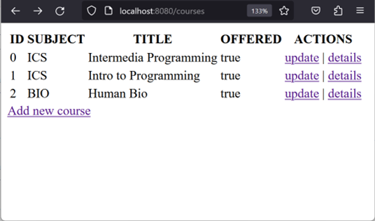

# ics625project3
 Manage courses using Spring MVC and JPA with database.
 
 Project 3:
Write a Spring MVC application that allows users to manage courses.  The user should be able to view all courses, add a new course, and view details of a course.  Your program should use a backend database to store the courses.

Below are examples of what your UI will look like.  Your interface does not have to be pretty but they need to be functional.  


 	 

The Course class has the following properties:
``` java
public class Course {
    private Integer id;
    private String number;
    private String subject;
    private String title;
    private Integer credits;
    private boolean offered;
    private String description;
}
```

Extra credit:  Highlight courses that are not offered as grey

